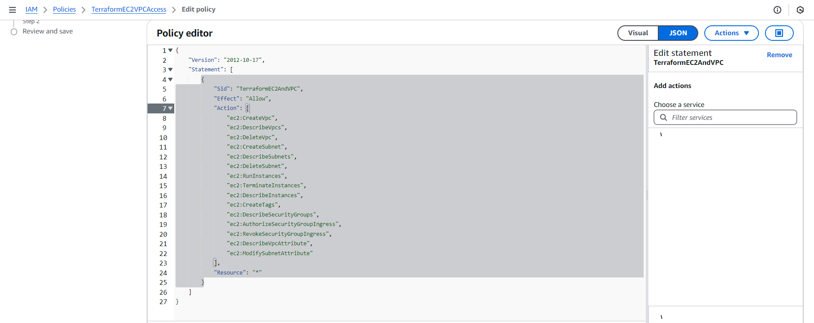

# 🚀 Terraform AWS EC2 Provisioning (CI/CD Automated)

This project automates the provisioning of AWS infrastructure using **Terraform** and **GitHub Actions**.  
It creates a VPC, public subnet, and multiple EC2 instances in `ap-southeast-2` (Sydney), with remote S3 backend and CI-based deployments.

---

## 🧱 Stack

- **Terraform** (modular)
- **AWS** (EC2, VPC, Subnet, S3)
- **GitHub Actions** (CI/CD)
- **IAM** (GitHub Secret-based authentication)

---

## 📂 Architecture
GitHub → GitHub Actions → Terraform → AWS (VPC + Subnet + EC2)


> 💡 Each `git push` to `main` triggers a deployment via `terraform init/plan/apply`.

---

## 🔧 Modules

- `network`: VPC and Subnet
- `compute`: EC2 instances

---

## ⚙️ GitHub Actions Workflow

Location: `.github/workflows/terraform.yml`

Steps:

1. Checkout repo
2. Setup Terraform CLI
3. `terraform init` with S3 backend
4. Format check (`fmt`)
5. Plan and auto-approve apply (`terraform apply`)

---

## 📤 Outputs

Example:

```bash
subnet_id         = subnet-0a2072b9...
ec2_instance_ids  = [ "i-04834c8...", "i-04c34fa..." ]
ec2_public_ips    = [ "13.55.14.22", "54.206.13.43" ]
```

---

## 🔐 Secrets (GitHub)
You must set the following repository secrets:

AWS_ACCESS_KEY_ID
AWS_SECRET_ACCESS_KEY

---

## 📎 Requirements
AWS CLI installed & configured

Terraform CLI installed (>= 1.0.0)

An S3 bucket for remote state already created

## 🚀 Deploy
```bash
terraform init
terraform plan -var-file="terraform.tfvars"
terraform apply -auto-approve -var-file="terraform.tfvars"
```

## 🧹 Destroy

```bash
terraform destroy -auto-approve -var-file="terraform.tfvars"
```

📸 Screenshot

*EC2 instance provisioning via Terraform*


*IAM permissions for GitHub Actions user*