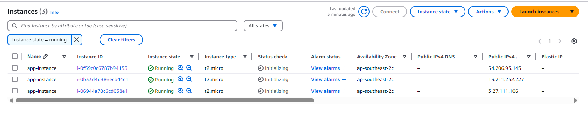

# Terraform AWS EC2 Provisioning (CI/CD Automated)

This project demonstrates how to provision AWS infrastructure using **modular Terraform** code and **GitHub Actions for CI/CD**.  
It automatically creates a **VPC**, **public subnet**, and **multiple EC2 instances** in the `ap-southeast-2` (Sydney) region, with remote S3 backend for state management.

---

## Tech Stack

- **Terraform** (modular)
- **AWS** (EC2, VPC, Subnet, S3)
- **GitHub Actions** (CI/CD)
- **IAM** (GitHub Secret-based authentication)

---

## Architecture Overview
GitHub → GitHub Actions → Terraform → AWS (VPC + Subnet + EC2)
On every git push to main, the CI pipeline runs terraform init, plan, and apply automatically.

---

## Terraform Modules

- `network`: VPC and Subnet
- `compute`: provisions EC2 instances
---

## GitHub Actions Workflow

Location: `.github/workflows/terraform.yml`

CI Steps:

1. Checkout repo
2. Setup Terraform CLI
3. `terraform init` with S3 backend
4. Format check (`terraform fmt -check`)
5. Plan and auto-approve apply (`terraform apply`)

---

## Required GitHub Secrets
You must set the following repository secrets:

AWS_ACCESS_KEY_ID: 	IAM User access key
AWS_SECRET_ACCESS_KEY:	IAM User secret access key

---

## Terraform Outputs (example)

Example:
```bash
subnet_id         = subnet-0a2072b9...
ec2_instance_ids  = [ "i-04834c8...", "i-04c34fa..." ]
ec2_public_ips    = [ "13.55.14.22", "54.206.13.43" ]
```

---

## Requirements
AWS CLI installed & configured

Terraform CLI installed (>= 1.0.0)

An S3 bucket for remote state already created

---

## Prerequisites
AWS account with an S3 bucket created for remote state
`terraform.tfvars` file with required variables:
```bash
region         = "ap-southeast-2"
vpc_cidr       = "10.0.0.0/16"
instance_count = 3
```
Terraform CLI installed (>= 1.0.0)
AWS CLI configured (for local testing)


---

##  Local Deployment
```bash
terraform init
terraform plan -var-file="terraform.tfvars"
terraform apply -auto-approve -var-file="terraform.tfvars"
```

---

## Destroy Resources
```bash
terraform destroy -auto-approve -var-file="terraform.tfvars"
```
You can also run this via `.github/workflows/terraform-destroy.yml`.

---

## Screenshot

*EC2 instance provisioning via Terraform*


*IAM permissions for GitHub Actions user*

---

## Outcome
Full CI/CD-based infrastructure provisioning workflow

Cleanly destroys all AWS resources via automation

Reusable module-based Terraform structure for future expansion
